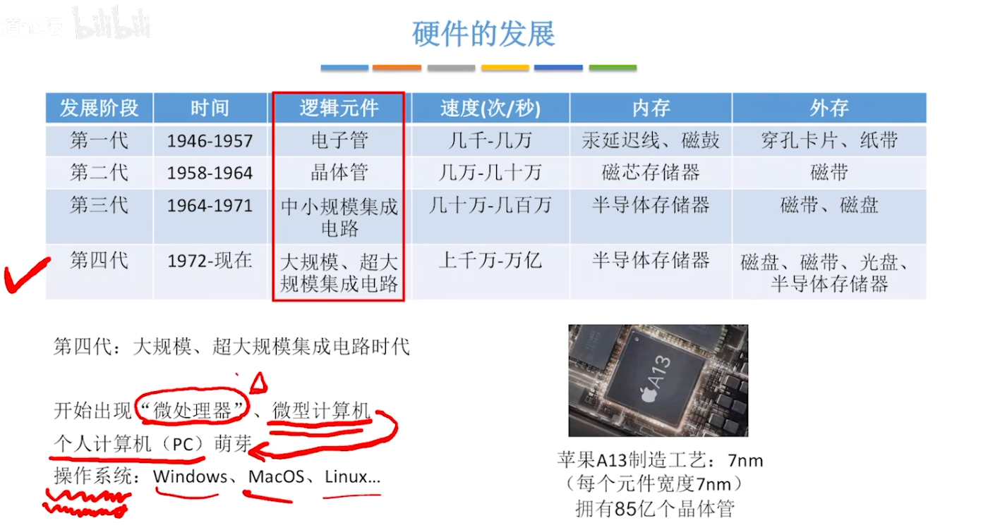
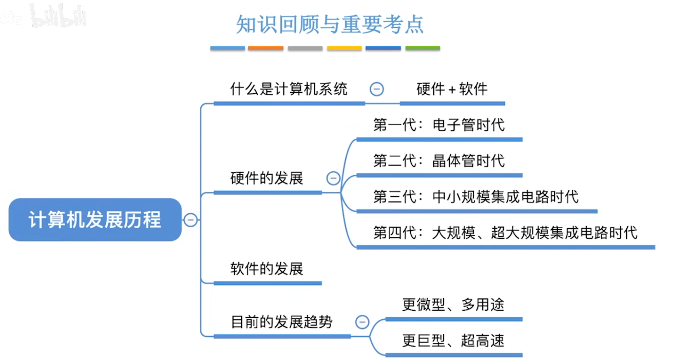
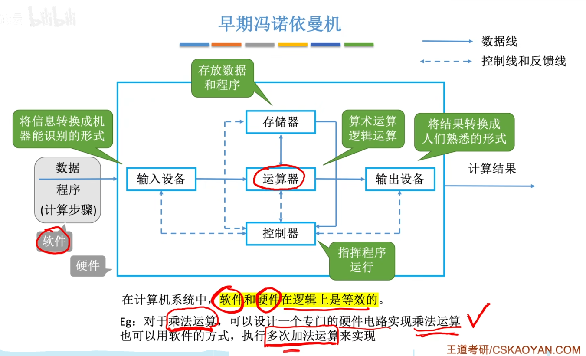
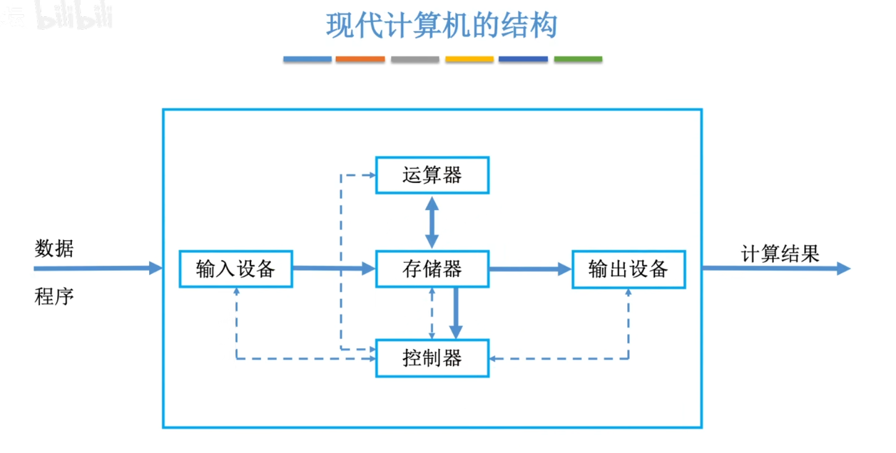
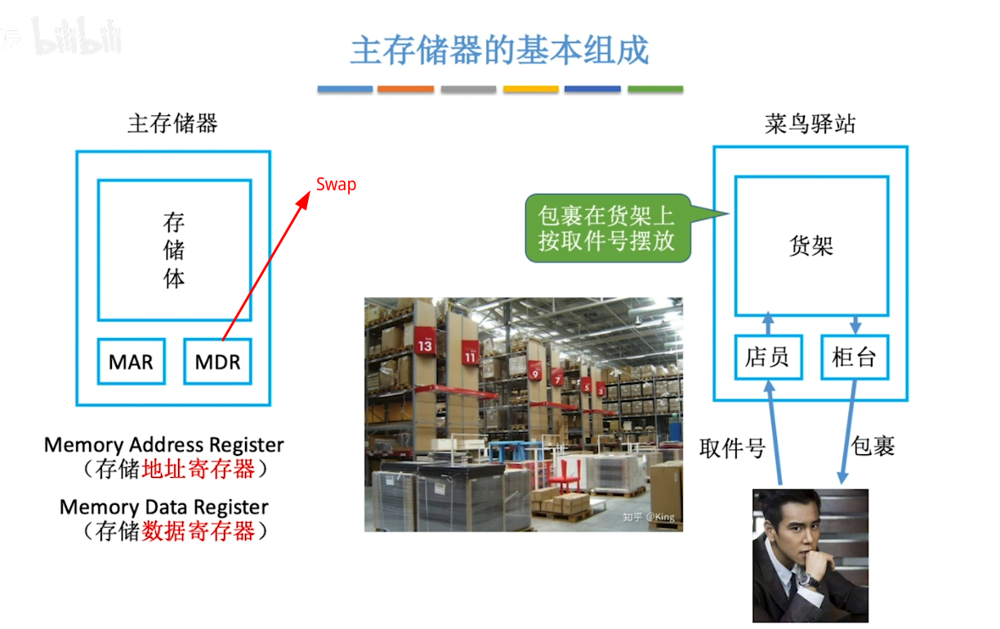
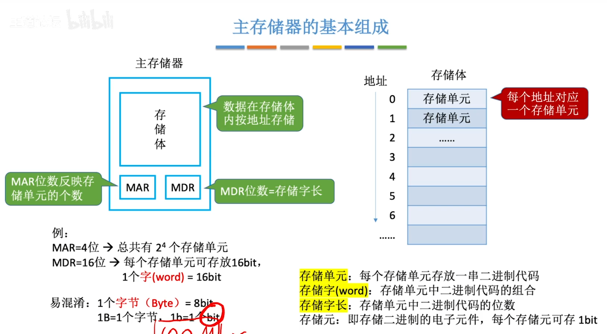

## 1 计算机的发展




机器字长 ---CPU ： 表示计算机一次整数运算所能处理的二进制位数

摩尔定律: 集成电路(CPU)上的晶体管数量每隔 一年半 翻一倍 --> 性能也会翻倍





### 1.2.1 计算机硬件的基本组成

“存储程序” --> 将程序存起来 --> 一条一条执行 --> 不需要手动接线了

冯诺依曼计算机是以 运算器为核心


```
用软件实现 --- 成本低且效率低   
用硬件实现 --- 成本高且效率高 

--- 这和汇编-高级语言同理hhh

冯诺依曼结构的计算机 --- 以运算器为核心 --- 但是要将输入数据先转移到存储器中 --- 再一步步拿出来给运算器 --> 效率低 
```

现代计算机以 存储器(内存) 为核心

```
存储器分为 --- 主存/辅存 

主存 --- 内存
	主存是存贮器	

辅存 --- 硬盘
	辅存是IO设备
```

### 1.2.2_认识各个硬件部件

#### 主存储器





```
运算器的基本组成: ACC(累加器) MQ(乘商寄存器) X(通用操作寄存器) | ALU(算数逻辑单元) --- 复杂逻辑电路
```
****
```
这里的控制器指的是CPU
	控制器的基本组成: 
		由指令寄存器IR（InstructionRegister）
		程序计数器PC（ProgramCounter）
		操作控制器OC（OperationController） --- CU

	1	取指令 --- PC
	2	分析指令 --- IR
	3	执行指令 --- OC （CU）
```