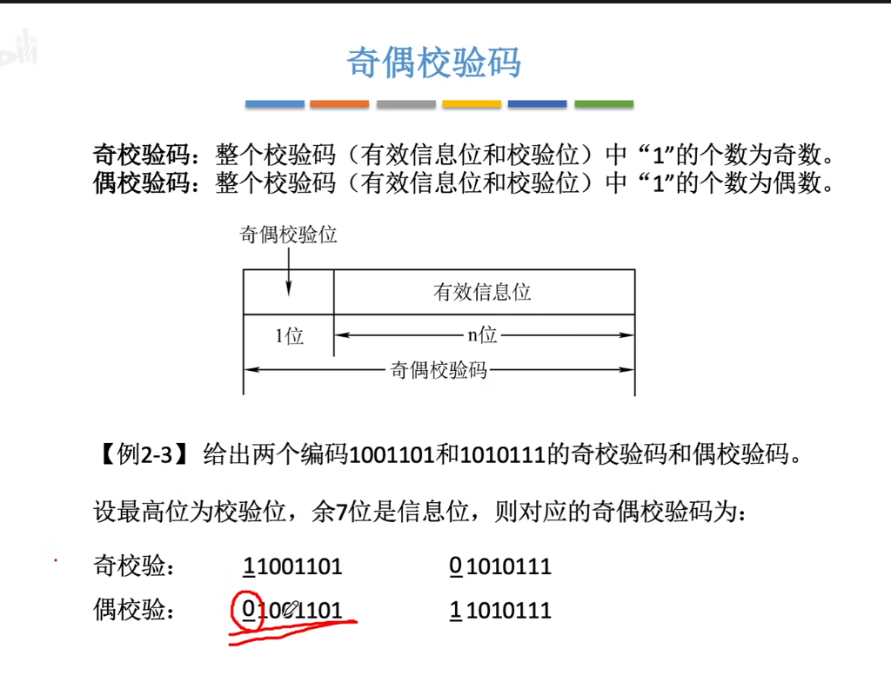
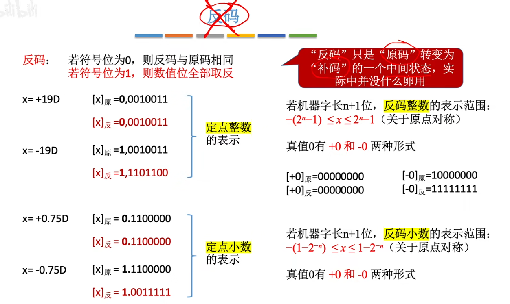
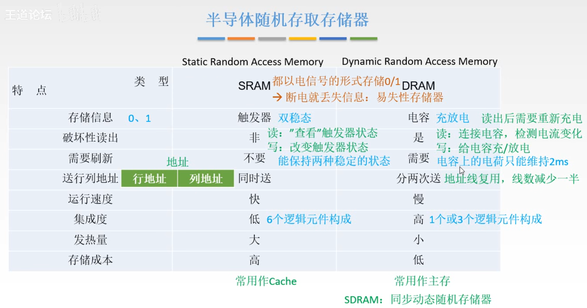
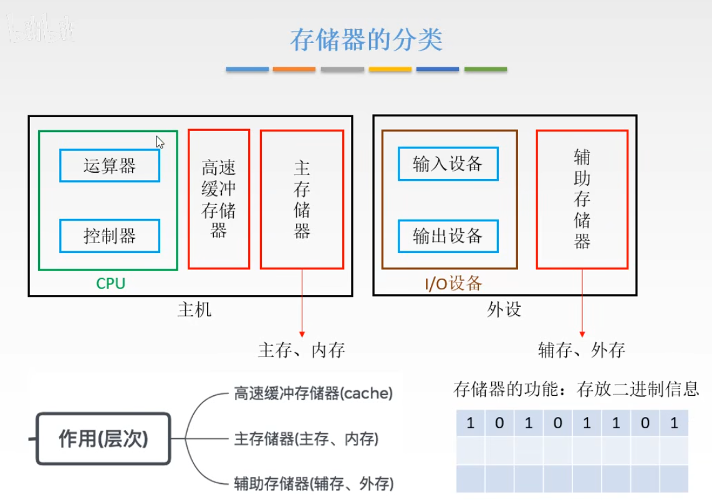

## 1 计算机的发展


机器字长 ---CPU ： 表示计算机一次整数运算所能处理的二进制位数

摩尔定律: 集成电路(CPU)上的晶体管数量每隔 一年半 翻一倍 --> 性能也会翻倍


### 1.2.1 计算机硬件的基本组成

“存储程序” --> 将程序存起来 --> 一条一条执行 --> 不需要手动接线了

冯诺依曼计算机是以 运算器为核心


```
用软件实现 --- 成本低且效率低   
用硬件实现 --- 成本高且效率高 

--- 这和汇编-高级语言同理hhh

冯诺依曼结构的计算机 --- 以运算器为核心 --- 但是要将输入数据先转移到存储器中 --- 再一步步拿出来给运算器 --> 效率低 
```

现代计算机以 存储器(内存) 为核心

```
存储器分为 --- 主存/辅存 

主存 --- 内存
	主存是存贮器	

辅存 --- 硬盘
	辅存是IO设备
```

### 1.2.2_认识各个硬件部件

#### 主存储器


```
运算器的基本组成: ACC(累加器) MQ(乘商寄存器) X(通用操作寄存器) | ALU(算数逻辑单元) --- 复杂逻辑电路
```
****
```
这里的控制器指的是CPU
	控制器的基本组成: 
		由指令寄存器IR（InstructionRegister）
		程序计数器PC（ProgramCounter）
		操作控制器OC（OperationController） --- CU

	1	取指令 --- PC
	2	分析指令 --- IR
	3	执行指令 --- OC （CU）
```


### 1.2.3 计算机系统的层次结构


```
	编译语言 : 编译一次 --- 永久执行 --- 效率高
	解释语言 : 每次执行都要编译 --- 效率低
```

### 1.3 计算机的性能指标
存储器的性能指标


 
CPU的性能指标


	最后一行很精辟hhh


基准程序就是 跑分软件(3D_MARK)

### 第二章 数据的表示和运算

#### 机器数
```
	接下来看书了hhh

	机器数 --- 带符号 / 无符号
		1 带符号就是第一位0/1 表示 正负
		2 无符号就是 正整数和0 hhh 

	举个例子: 
		8位机器数 --- 如果是 带符号数 --- 可以表示 -127 ~ 127 

		8位机器数 --- 无符号数 --- 表示 0 - 255 
```	
****

#### 原码
就是将数变成有符号机器数 

```
	0.1010110 --- 原码 : 0.1010110 
   -0.10100110 --- 原码: 1.10100110   正数加0,负数加上1

   +1010110 --> 01010110
   -1010110 --> 11010110

   原码的移位  x -> 2x / (1/2)x 

   x = 0.0101001 -->   2x = 0.1010010  
   				 --> 0.5x = 0.0010100    符号位不变, 2x 全体左移 , 1/2x 全体右移 , 缺了补0

   x = 10011010 -->  2x = 10110100
     		    -->0.5x = 10001101
```

#### 补码
(正数/0 的补码就是他的原码 , 负数的补码是他数值位按位取反+1)

```
	补码的移位规则    符号位不变 2x左移 , 0.5右移 , 缺了补和符号位向同的 
	
	x = 11011010 -->     2x = 10110100
	             -->   0.5x = 11101101		// 补的是1
```

#### 反码
反码 比 补码小1 --- 反码 = 补码 - 1 

#### 2.1.2 BCD码
因为二进制 和 十进制的转换太阴间了 --- 2^4 16种可能 --> 可以表示十进制 --> 一些别的编码

```
	四位 --> 表示一个十进制数
		985 = 1001 1000 0101 					 0000 - 1001 
	8421 码的加法 --- 8 + 5 = 1000 + 0101 = 1101 （不在8421码的区间）+ 0110 --> 0001 0011 (+6修正) 

!!	也可以十进制手算 --- 8+5 = 13 --- 再使用8421码转化 ---- 1 - 0001 ， 3 - 0011 --> 0001 0011 
``` 

**** 
修改编码规则 ---> 得到其他编码 

```
余三码: 8421码 + 0011 (加3)

2421码 和 8421码同理
```

注意: 8421码和2421码的每位权值是不变的(8，4，2，1) --- 有权码  | 但是余三码是 --- 无权码 


#### 2.1.3 字符与字符串

把字符映射成二进制数

比如实现 通信的ACK --- 0110 (确认报文hhh)

```
	(ASCII)英文用8bit --- 表示所有字符

	但是汉字不行捏 --> GB2312编码(7445个汉字) --- 区位码 --- x,y -> '你'

	通信的时候 是将GB2312 增加了偏移量(避开了ASCII码0-31这个 和通信有关的区间) --> 得到了 国标码 --> + 80H --> 机内码

	搞了这么多次转化 --- 为了避开 ACSII码的0-93  (和英文字符分开hhh)
```


大小端  --- 大端模式 : 把最大数放在最左端的 / 小端模式 : 把最小数放在最左端的 

#### 2.1.4  奇偶校验码

这就是计网学的 = = 


```
	对于一串bit   奇/偶校验  同时发生 奇数/偶数 个错误 --> 失效 ---> 所以局限性很大hhh

	奇偶校验 --- 对象是‘1’的个数 --- 实现: 偶校验的检测码是 按位异或 -> 奇校验的是偶校验的非

	11011001 --- 偶校验1 --- 奇校验0 
```

#### 2.1.5 海明码

奇偶校验码 --- 就算可以判断错误 --- 但是不能纠错

```
	具体实现 --- 把信息分成k个组 --- 每个分组添加一个奇偶校验位
```


 


笑死,海明校验码出现两位及以上错 --- 就没法纠错了hhhh

#### 2.1.5 CRC循环冗余校验码 = =
生成多项式 hhh  

```
	这个可以看计网的hhhh

	除数是生成多项式的原码 , 被除数是要发送的bit串

	二进制的除法是 模2除(异或)

	生成多项式的余数  = =  余数位数要和生成多项式的最高次项数相同
```

### 2.2.1 定点数


对所有进制都可以这样表示 = =

```
	1111 1111 = 2 ^ 8 - 1 = 255 --- 八位无符号数范围 0 - 255 (unsigned)

	1111 1111 有符号数 -127 - 127 
```

小数点的左边是2^0 , 右边是 2^-1 , 如果规定机器字长,长度不够要补0 


正数的反码是自己 , 负数的反码是符号位不变,其他位按位取反


移码就是补码的符号位取反


移码可以很方便判断哪个数真值更大

```
	由一个数的 原码,补码,反码,移码 --- 算真值

	原码 --- 符号位
	反码 --- 除了符号位,其他位取反,转化成原码
	补码 --- 转化为反码-1
	移码 --- 全部取反-1 

	注意几个点 正数的补码和原码一样,正数的反码和原码一样

	移码 10001101 --- 补码 00001101 --- 正数所以补码等于原码 --- 13  
```


#### 2.2.2 这些码的作用

硬件实现减法功能很麻烦 --- 补码(用加法替换减法) --- 本质是取余 (-3 mod 12 同余 9 mod 12  = 9 )
```
	-3 mod 12 --> -3 * x + r = 12 --> x = -1 , r = 9  exgcd  hhh

	找到互补的数 --- 就可以用加法替代减法 

	14 - 14 = 14 + (-14) 

	14    0000 1110 
   -14    1111 0010   -14的补码 
   	   = 10000 0000 
```

### 2.2.3 移位运算

对于定点数 --- 因为移位运算本质是移动小数点 --- 可惜定点数不能移动小数点 --- 所以移动数值位 , 补0 
****
原码的移位


反码的移位

```
	正数的 反码 和 原码 一样 --- 移位运算也是一样的

	负数的 反码 的 1 是 原码的 0 --- 高位补1 
```

补码的移位  --- 左移补0 ， 右移补1


移位的总结


逻辑移位 --- 对无符号数的移位运算


循环移位

使用 循环移位 --- 转换大小端模式 (好偏僻的东西hhhh)


#### 2.2.4 定点数的加减运算

补码的加减 --- A补 + B补 = [A+B]补 A补 -B补 = [A-b]补 

```
	两个数的加减 --- 两个数的补码的加 --- 再从补码转换成 原码 hhh ---> 计算机直接存补码的
```

上溢 和 下溢


#### 2.2.5-1 原码的乘法运算

二进制的除法 --- 和十进制手算除法是一样的 ---


```
	乘数是0 + 0 / 乘数是1 + |x| 

	先加法 , 再右移

	最后单独处理 符号位 --- 异或a,b的符号位 --> 结果的符号位
```
#### 2.2.5-2 补码的乘法


#### 2.2.6-1 原码的除法


#### 2.2.6-2 补码的除法运算


#### 2.31.1 浮点数的表示和运算


### 第三章  运算器方法 和 运算器


```
	1K = 1024 
	字长是4B --- 字 

	1KB = 1K * 1B  按字节就是 1K 个单元
	字是字长 --- 所以按字是 1024 / 4 = 256单元
	半字 --- 1024/2 = 512单元
	双字 --- 1024/8 = 128单元
```


#### 3.3.1 半导体存储器RAM


半导体随机存储器 --- 随机存取储存器 RAM --- 断电不保存 --- 就是内存条hhh/ 只读存储器 ROM --- 断电保存 

****
```
RAM --> SRAM ,  DRAM ,   | NV-RAM 
		静态RAM  动态RAM  | 非易失性RAM

这里的DRAM --> 就是你电脑上的DDR4内存 hhh
SRAM --- Cache 
```



  

#### 3.3.2 半导体存储器ROM
```
CPU 通电后 --- 去主存里面拿指令 --- 主存断电之后没东西 --- 所以需要永久的存储器把信息传到主存 --- 硬盘hhh
	
	但是硬盘是通过总线和主存连接的 --- 所以CPU内部还需要永久性的存储器 --- ROM

	ROM的速度很慢 , 所以还是需要高速的 RAM  

	ROM -- read-only-memory  只能一次写入,BIOS就是写入ROM的一种软件 !!!
```

ROM 也作为缓存

保存的作用 --- 把RAM的内容保存到辅存中


#### 3.3.3 存储器的整理



存储器的性能指标 --- 存储容量 ; 单位成本 ; 存储速度 ; 


存储时间 > 存取+恢复 , 因为还存在刷新,复写等操作


速度要快 --- 电学结构复杂 --- 物理存储容量小  (这样此长彼短的感觉hhhh)


#### 3.4.1 主存与CPU的连接


