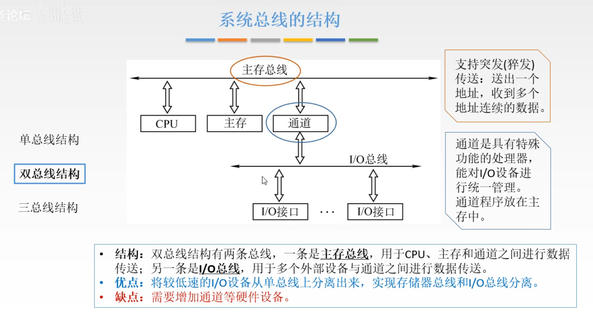
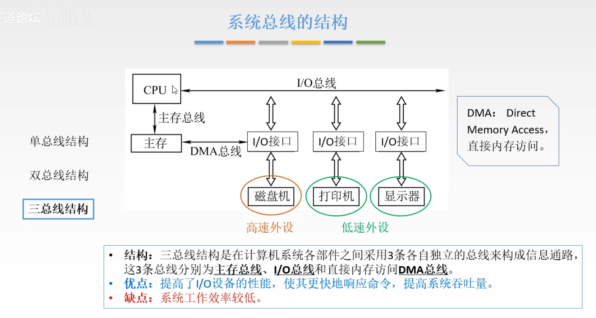

1 - 9 章 

finished : 1 2 3 4 5 8 9 
习题: 1 2 3 4 5  8 9


#### 第二章习题

表示一个汉字需要多少字节 --- 2个字节 (x,y)

表示一个32x32点阵的字形码需要多少字节 --- 一个bit表示一格 --- 需要32x32bit --- 也就是 32x32/8 B --- 128B  
每个点要用01表示有没有 --- 所以每个点都是1bit

计算机内部利用字节的最高位是0还是1区分字符信息与汉字信息

奇偶校验码的 码距为2 ，所以可以 检出1位错或奇数位错 ， 无纠错能力 

#### 规格化补码表示 --- 跳了 --- p59 2.26 (4)

定点数的加法 --- 转化成补码相加 --- 注意负数补码的问题 --- x-y = [x-y]补 = [x]补 + [-y]补 --- 算出来[x-y]补 --- 如果是负数的补码 --- 再转成原码

```
对于双符号位定点数加减法 --- +0.0011 --> 00.0011（双符号位） 如果 最前面两位异或=1 --> 说明发生了溢出 
	如果进位超出前两位,多的直接舍去,溢出只看s1,s2这两位的异或 --- 异或结果是1 --> 说明溢出

```


因为计算机使用补码进行加减 --- 同时也用补码进行存储 --- 所以乘除操作 --- 为了省去转化操作 --- 乘除也是使用补码hhh
#### 第三章  运算器方法 和 运算器

#### 第五章
重点 : 寻址

#### 第六章


#### 第七章


#### 第八章

若显示器灰度是16位 --- 每个像素的显示位数 --- 4位 (2^4 = 16) - 4bit

一台可以显示256种颜色的彩色显示器 --- 每个像素显示存储单元 --- 8位 (2^8 = 256) - 8bit

一台分辨率是1024x768像素，像素颜色数为256,问显存至少要多大 (显示缓冲存储器的大小hhh)

1024 x 768 x 8bit(2^8=256) / 8 bit = 3x2^18 B 

且 K = 2^10 , G = 2^20 , 至少需要 1MB (选择题,只有这个满足至少 3x2^18)

计算机的外围设备 --- 输入设备，输出设备，外存储器，终端，其他含义的I/O设备

显存的容量是由 --- 分辨率 和 灰度级或色彩度 决定的


#### 第九章

主机和外围设备的连接方式 --- 总线型 / 通道控制 / I/O处理机控制 连接方式

```
	总线型 :  优点 I/O 接口扩充方便  缺点 依赖总线,总线容易成为系统的瓶颈,不适用于要接入大量I/O设备的系统中
```
通道控制 


I/O处理机控制连接方式
 


IO接口的分类
```
	并行 和 串行 : --- 按 数据传输格式
		串行 : 每次传输一bit 
		并行 ：每次传输一字节/字

	同步接口和异步接口 :
		同步接口 与 同步总线相连接，接口与总线的数据传输按统一的时钟来同步

		异步接口 与 异步总线连接,采用异步应答的方式传输数据

```


9.7 选择题 后六道 --- 学习 DAM 

```
	DMA 与主存交换数据的三种方式
		1 停止CPU访问主存 --- 这段时间DMA通道占据了主存的访问权限
		
		2 周期挪用 (周期指 访存周期 ) 
		
		3 CPU和DMA交替访存 --- 速度比较快 --- 1 2 1 2 这样交替的访问

	每通过一次DMA传输一次数据 --- 占用一次 总线时间
```

